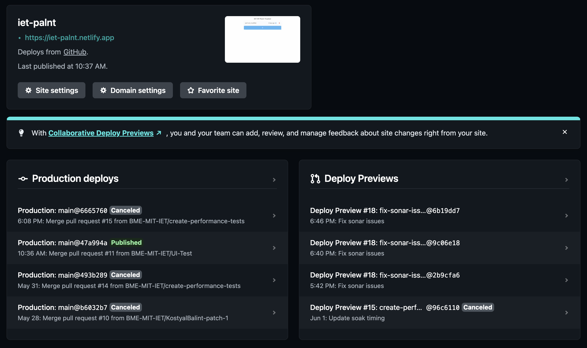
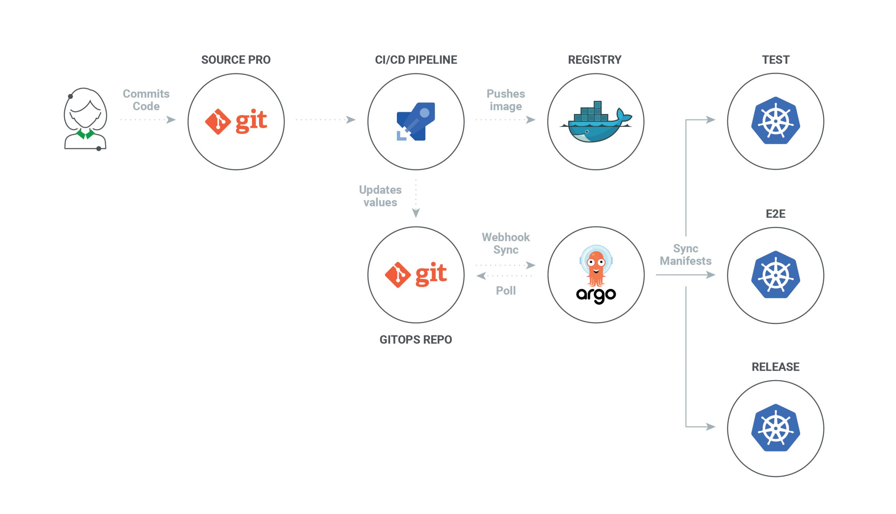
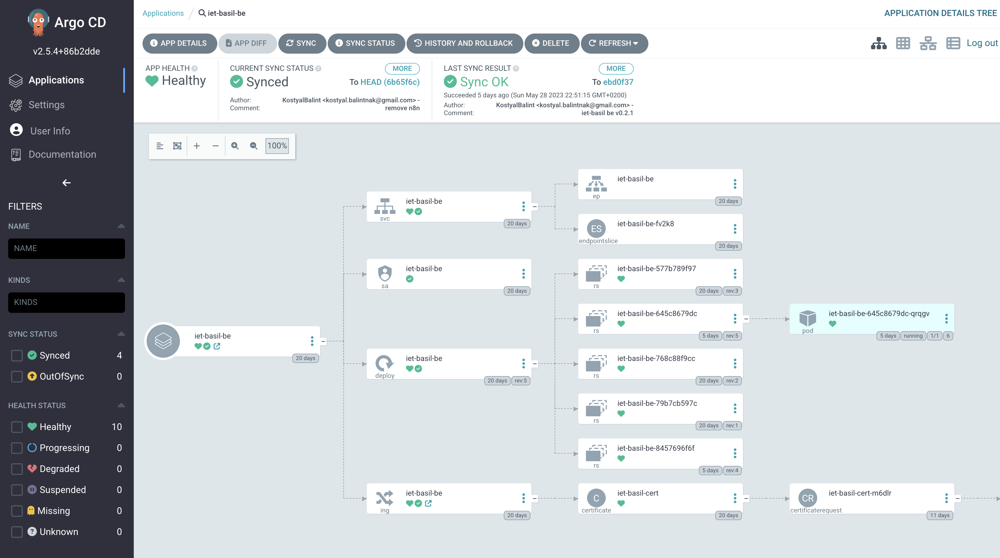

## Alkalmazás telepítése

Az alkalmazás a mai cloud native technológiáknak megfelelően kerül kitelepítésre.
A frontend és a backend külön-külön kerül kitelepítésre, a frontend egy Netlify
szolgáltatásra, a backend pedig egy saját Kubernetes klaszterre.

### Frontend

A frontend telepítését a [Netlify](https://www.netlify.com/) szolgáltatás végzi. 
Ez a szolgáltatás kifejezetten egyszerűvé teszi a React-ben készült kód automatikus kitelepítését.
A Netlify szolgáltatás a Github-on lévő kódot figyeli, és minden `main` ágra történő `push`-ra automatikusan
kitelepíti azt. Mivel a main ág védett ág, így oda csak pull request által kerülhet kód, így a kód
automatikus kitelepítése biztonságos, és legalább 1 másik ember jóváhagyást igényli.

### Backend 

A backend telepítése egy saját Kubernetes klaszterre történik. 

A build folyamatot egy Github-on futó Github Actions pipeline végzi. Ez a pipeline a 
Docker image-et készíti el, és feltölti azt a Gitlab Docker Registry-be.

A konténer indítását és a Kubernetes klaszteren való futtatását pedig az ArgoCD nevü GitOps eszköz végzi.

A Kubernetesbe telepített alkalmazás a következőképpen néz ki, melyet az ArgoCD felületén lehet megtekinteni:

