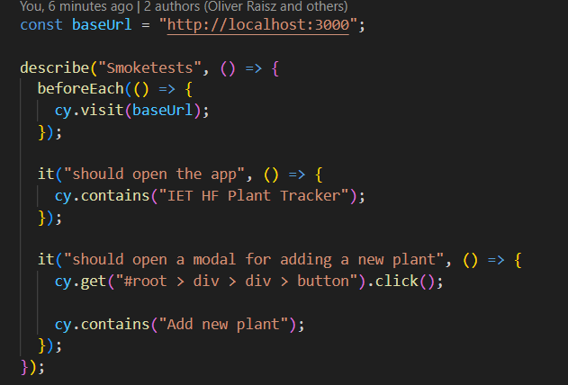
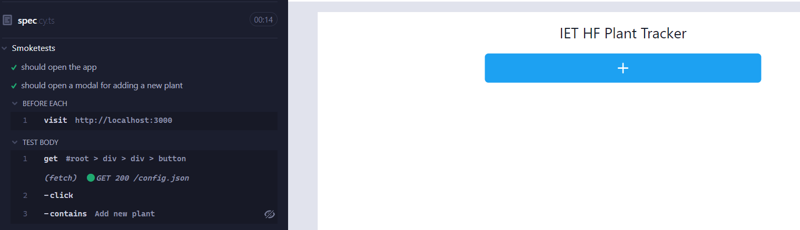
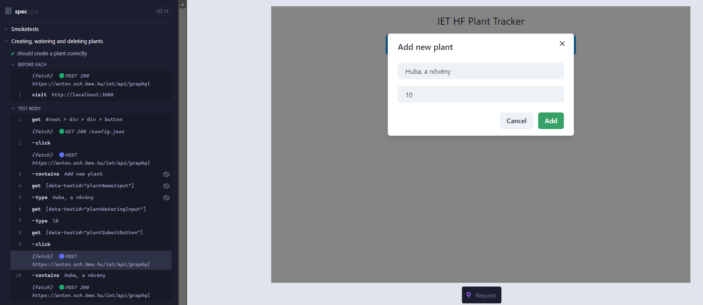
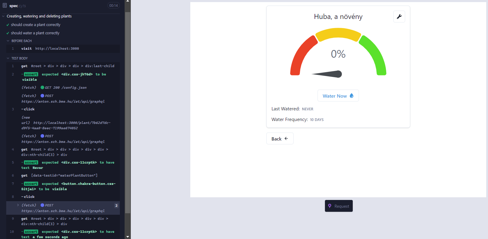
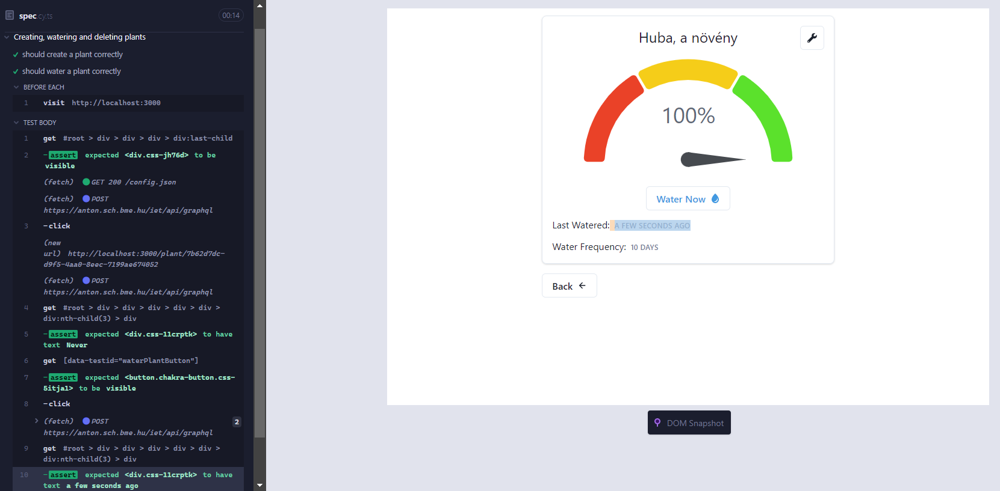
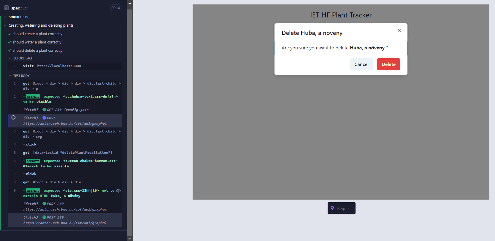

# UI Test with Cypress

A felhasználói felület teszteléséhez Cypress-t használtunk, a felhasználóbarát tesztírás, magas szintű automatizáltság és egyszerű felhasználói felület miatt.

## Első teszt: Weboldal betöltésének és felugró ablak ellenőrzése

- A tesztek kódja hasonló, ezért csak ezt az egyet mutatjuk be. A _beforeEach_, a teszt futása előtt kerül futtatásra, az _it_ függvényekbe kerülnek maguk a tesztek. A tesztben ellenőrzésre kerül, hogy valóban megjelenik-e az oldal címe, illetve a gomb megnyomásával megjelenik-e a felugró ablak.

- Itt a Cypress felhasználói felületének egy részletét láthatjuk, ahol bal oldalon látszanak a tesztek és lefolyásuk menete, bal oldalon pedig nyomon lehet követni, a weboldal állapotait a teszt során.

## Második Teszt: Növény hozzáadása

- Ebben a tesztben azt ellenőrizzük, hogy valóban hozzá lehet-e adni egy növényt az adatbázishoz, valamint azt hogy helyesen jelenik-e meg a hozzáadott növény.

## Harmadik Teszt: Növény meglocsolása

- Itt azt vizsgáljuk, hogy a növényről kapott adatok, megfelelnek-e ez elvégzett interakcióknak, jelen esetben az öntözés legutolsó időpontját vizsgáltuk.

### Öntözés előtt

### Öntözés után

## Negyedik Teszt: Növény törlése

-Itt azt vizsgáljuk, hogy a növény törölhető-e az adatbázisból.

# Végső Tapasztalatok

- Gyengén és dinamikusan típusos nyelvekkel dolgozni nehéz, sok gyakorlatot igényel.
- Ezeket a nehézségeket a Cypress egyszerű kódolhatósága, és kiemelkedő felhasználói felülete nagy mértékben ellensúlyozza.
- Jól skálázható megoldás e2e teszteléshez, mivel egy-két sor kóddal gyarkolatilag egységekre, unit-okra lehet bontani a weboldal funkcióit.
